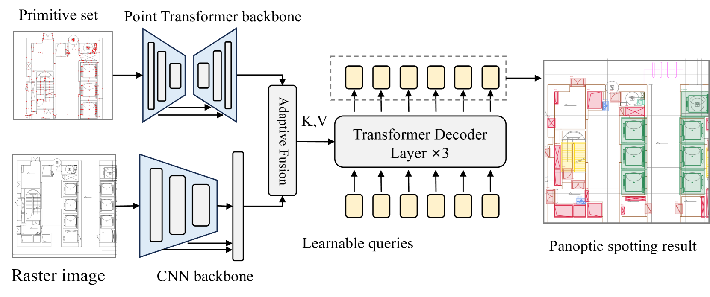

<h2 align="center">ArchCAD-400k: A Large-Scale CAD drawings Dataset and New Baseline for Panoptic Symbol Spotting
</h2>
 
<p align="center">
  
</p>
 
<div align="center">
 
[](https://arxiv.org/abs/2503.22346)  [](https://github.com/ArchiAI-LAB/ArchCAD)  [](https://huggingface.co/datasets/jackluoluo/ArchCAD)  [](LICENSE)
 
</div>


## 🌟 News
- **2025/10/16:** Source code of **DPSS** is released !
- **2025/10/16:** First round of open source of **ArchCAD** Dataset !
- **2025/10/9:** Our project homepage is released ! 
- **2025/9/19:** Our paper is accepted in **NeurIPS 2025** !  🎉


## 📖 Abstract
This repository contains the official implementation of **Dual-Pathway Symbol Spotter (DPSS)**, a new baseline model for panoptic symbol spotting in architectural CAD drawings, which was introduced in our paper "ArchCAD-400K: An Open Large-Scale Architectural CAD Dataset and New Baseline for Panoptic Symbol Spotting". For more information about the project, please refer to our <a href="https://archiai-lab.github.io/ArchCAD.github.io/" style="text-decoration: underline;">Project Page</a>. 

## 🔥 Highlights
- **ArchCAD-400K**: The first large-scale architectural CAD dataset with 400K+ symbols
- **DPSS Model**: Novel dual-pathway architecture for panoptic symbol spotting
- **Comprehensive Evaluation**: Extensive experiments and benchmarks
- **Open Source**: Both dataset and model code are publicly available

## 🔧Installation & Dataset
### Environment

We provide an installation script to set up all dependencies:

```bash
bash install.sh
```

Download the required pretrained model weights:

```bash
cd svgnet/pretrained
bash install.sh
```

### Dataset&Preprocess

#### ArchCAD-400K

We are pleased to announce the initial public release of the ArchCAD dataset. This first batch opens a curated subset of 40K high-quality samples, representing a more refined portion of the full collection. This release aims to facilitate preliminary research, with plans for subsequent releases in the future. Please visit our <a href="https://huggingface.co/datasets/jackluoluo/ArchCAD" style="text-decoration: underline;">HuggingFace</a> page and download the dataset.


#### FloorplanCAD 

download dataset from floorplan website, and convert it to json format data for training and testing.


```python
# download dataset (test split; use --split all for train too)
python dataset/download_data.py --split test

# preprocess: SVG -> json (+ copies the matching png render)
python dataset/parse_FpCAD_svg.py \
    --data_dir   dataset/FloorplanCAD/test \
    --output_dir dataset/FloorplanCAD/json/test \
    --png_dir    dataset/FloorplanCAD/test
```

The loader discovers drawings by directory (`<data_root>/<split>/*_s2.json`), so
no separate `dataset_split.json` step is needed.

> **Note on class ids.** FloorPlanCAD's SVGs number their classes differently
> from the label space the model trains on. `parse_FpCAD_svg.py` applies the
> official remap (`RAW_TO_CLASS_ID`, taken from the CADTransformer baseline)
> and emits 0-based class indices with 35 as background. FloorPlanCAD has
> **35 classes**, not ArchCAD's 30 — use `configs/svg/svg_pointT_fpcad.yaml`.

> **Use the original vector release, not a rasterised mirror.** DPSS reads each
> drawing as vector primitives *and* as an image. Rasterised redistributions
> (e.g. the Voxel51 HuggingFace copy) contain only PNGs, so the per-primitive
> coordinates and CAD layer ids the vector pathway needs are not recoverable
> from them.

## 🖥️ Running on CPU

The point-cloud pathway normally depends on a compiled CUDA extension
(`modules/pointops`). `modules/pointops/functions/pointops.py` provides a pure
PyTorch implementation of the ops DPSS uses (`knnquery`, `furthestsampling`,
`queryandgroup`, `interpolation`, `sectorized_fps`), so the model runs without
a GPU. Set `ARCHCAD_DEVICE=cpu` to force it; otherwise CUDA is used when
available.

`detectron2` is likewise optional — `svgnet/util/d2_compat.py` supplies the
three symbols the project actually imports from it.

```bash
bash tools/demo_cpu.sh
```

Roughly 2 s per 2,000 primitives and 6 s per 7,400 on a 4-core CPU. Training is
still GPU work; this path is for inference, debugging and small experiments.

> No trained DPSS checkpoint has been published. Without one the demo runs with
> randomly initialised weights: it exercises the full pipeline, but the
> predictions are meaningless (PQ ≈ 0) until you train the model yourself.

## 🏆 Reproducing the paper's accuracy

`configs/svg/svg_pointT_fpcad_repro.yaml` follows the recipe in
arXiv:2503.22346 §Implementation, which differs from the shipped
`svg_pointT.yaml` in three places worth knowing about:

| | Paper | Shipped config |
|---|---|---|
| Input resolution | **700×700** | 980 |
| Learning rate | **2e-4** | 1e-5 (20× lower) |
| Epochs (FloorPlanCAD) | **50** | 100 |
| Batch | 2 per GPU × 8 GPUs = **16 effective** | 8 per GPU |

Target: **PQ 86.2 / SQ 93.0 / RQ 92.6** without priors (89.5 / 96.2 / 93.1 with).
SymPointV2 reaches 83.2 PQ for comparison.

```bash
# 8 GPUs, exactly as the paper
GPUS=8 CONFIG=configs/svg/svg_pointT_fpcad_repro.yaml bash tools/train_dist.sh

# or one 80GB GPU — same effective batch, BatchNorm still sees all 16
#   set batch_size: 16 and accumulate_steps: 1 in the config
```

**Accuracy depends on effective batch, precision, epochs and initialisation —
not on which GPU you rent.** More or faster GPUs buy wall-clock, not PQ. Keep
`fp16: False` if you have the memory; there is no accuracy reason to use it.

**Known gap.** The paper initialises the point branch from a PointTransformerV2
encoder pretrained on ScanNetV2. This release ships PointTransformer *v1*
blocks and no such checkpoint, so that pathway trains from scratch. Together
with the absence of a published DPSS checkpoint, expect to land somewhat below
the reported PQ.

## 🎛️ Choosing a training config

`tools/train_dist.sh` assumes 8 GPUs. For a single GPU use `tools/train_single.sh`
(no torchrun, no `--dist`, no `--sync_bn`).

Peak memory for **one training step, fp32, batch 1**, measured on the largest
drawing in the FloorPlanCAD test split (7,392 primitives, 60 instances).
Figures include parameters, gradients and AdamW state. `fp16: True` reduces
the activation share substantially.

| Config | Input | Queries | Vision | Batch | Peak |
|---|---|---|---|---|---|
| `svg_pointT_fpcad_repro.yaml` | 700 | 800 | HRNet-48 | 1 | **6.0 GB** |
| `svg_pointT_fpcad_repro.yaml` | 700 | 800 | HRNet-48 | 2 | **10.0 GB** |
| `svg_pointT_fpcad_paper12gb.yaml` | 980 | 800 | HRNet-48 | 1 ×16 accum | **7.8 GB** |
| `svg_pointT_fpcad_12gb.yaml` | 512 | 400 | HRNet-48 | 1 ×16 accum | **3.8 GB** |
| (512 / 400, batch 2) | 512 | 400 | HRNet-48 | 2 | 6.9 GB |
| (384 / 200, batch 1) | 384 | 200 | HRNet-48 | 1 | 2.0 GB |
| (980 / 800, batch 2) | 980 | 800 | HRNet-48 | 2 | ~14 GB — does not fit 12 GB |

`svg_pointT_fpcad_paper12gb.yaml` is the best-quality option for a 12GB card:
the model is exactly the paper's, and only the batch is traded away.

### Gradient accumulation

The paper trains at an effective batch of ~64 (8 GPUs × 8). A single GPU can
only hold 1–2 drawings at 980px, which makes Hungarian matching noisy. Set:

```yaml
accumulate_steps: 16   # effective batch = batch_size * accumulate_steps
```

`train.py` scales the learning rate from the *effective* batch, so leave
`optimizer.lr` at the `1e-5` default (which the code documents as tuned for
batch 16) and let it compute the rest.

### Smaller / faster: HRNet-18

The image branch is 65M of the model's 101M parameters. `configs/svg/hrnet18.yaml`
swaps in HRNet-W18 (≈10M), roughly halving both parameters and activation
memory:

```yaml
vision:
  backbone: "hrnet18"
  yaml: "configs/svg/hrnet18.yaml"
  pretrained: ""      # empty = train from scratch; no W18 checkpoint ships here
```

Measured 4.3 GB at 384px / 200 queries / batch 2. **Expect lower accuracy**:
only HRNet-48 has pretrained COCO-Stuff weights here, so with W18 the image
pathway starts from random initialisation. Use it when throughput matters more
than the final score.

## 🚀Quick Start

```bash 
# train
bash tools/train_dist.sh
# test
bash tools/test_dist.sh

```


## TODO list:
- [ ] Release our tools **CADParser** for CAD processing.
- [ ] Release a highly optimized version of **DPSS** Framework.

## Acknowledgement
We sincerely thank the authors of [CADTransformer](https://github.com/VITA-Group/CADTransformer), [SymPoint](https://github.com/nicehuster/SymPoint), [SymPointV2](https://github.com/nicehuster/SymPointV2) for their inspiring open-source contributions.
We also thank all engineers and researchers involved in the data annotation, compilation, and review process.


## 📌 Citation

If you find this work useful in your research, please consider citing:

```bibtex
@article{luo2025archcad,
  title={ArchCAD-400K: An Open Large-Scale Architectural CAD Dataset and New Baseline for Panoptic Symbol Spotting},
  author={Luo, R and Liu, Z and Cheng, T and others},
  journal={arXiv preprint arXiv:2503.22346},
  year={2025}
}
```
